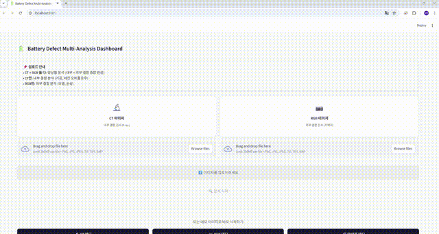

# Battery Defect Inspection AI System

리튬이온 배터리의 내부(CT) 및 외부(RGB) 결함을 자동 검출하는 AI 기반 품질 검사 시스템


## 주요 기능

- **멀티모달 분석**: CT 이미지(내부 결함) + RGB 이미지(외부 결함) 동시 분석
- **3-Way 검사 시스템**: CNN + AutoEncoder + VLM/VLG 다중 모델 검증
- **설명 가능한 AI**: Grad-CAM, Error Map, Bounding Box 시각화
- **실시간 웹 대시보드**: Streamlit 기반 즉시 결과 확인

## 시스템 아키텍처

```
[배터리 이미지 입력: CT + RGB]
           ↓
┌──────────────────────────────────────────────────┐
│  System 1: CNN+AE+Grad-CAM 통합 검사              │
│  ┌────────────────┬──────────────────┐           │
│  │  CT CNN        │  RGB AutoEncoder │           │
│  │  (ResNet18)    │  (CAE)           │           │
│  │  5클래스 분류   │  이상 탐지        │           │
│  └────────────────┴──────────────────┘           │
│           ↓                ↓                     │
│  ┌──────────────────────────────────┐            │
│  │ 논리적 조합 (AND/OR)              │            │
│  │ → 정상/내부불량/외부불량/복합불량   │            │
│  └──────────────────────────────────┘            │
│  + Grad-CAM 히트맵                                │
└──────────────────────────────────────────────────┘
                    VS (비교)
┌──────────────────────────────────────────────────┐
│  System 2: VLM (Gemini / Qwen2-VL)               │
│  → Zero-shot 판정 + 불량 원인 설명                 │
└──────────────────────────────────────────────────┘
                    VS
┌──────────────────────────────────────────────────┐
│  System 3: VLG (GroundingDINO / YOLO-World)      │
│  → 불량 영역 BBox 검출                            │
└──────────────────────────────────────────────────┘
           ↓
┌──────────────────────────────────────────────────┐
│  Web UI: 3개 시스템 결과 비교 시각화               │
└──────────────────────────────────────────────────┘
```

## 결과 표시 방식

3개 모델이 각각 독립적으로 분석한 결과를 나란히 표시합니다.

| 모델 | 역할 | 판정 방식 |
|------|------|----------|
| **통합 검사기** | 정량적 분류 | CT+RGB 논리적 결합 (내부/외부/복합불량) |
| **VLM** | 정성적 분석 | 자연어 기반 결함 설명 |
| **VLG** | 위치 검출 | Bounding Box 시각화 |

> **통합 검사기**: CT CNN과 RGB AE 결과를 논리적으로 결합(AND/OR)하여 최종 판정

## 모델 성능

| 모델 | 역할 | Test 정확도 | 비고 |
|------|------|-------------|------|
| **CT CNN** (ResNet18) | 내부 결함 분류 | **77.4%** (F1: 78.8%) | 5클래스 분류 |
| **RGB AutoEncoder** | 외부 결함 탐지 | **98.85%** (F1: 99.4%) | 이상 탐지 |
| **VLM** (Gemini 2.0) | AI 소견서 생성 | - | API 기반 |
| **VLG** (GroundingDINO) | 결함 위치 탐지 | - | Open-vocab |

## CT CNN 학습 설정

### 클래스 불균형 해결
배터리 결함 데이터의 극심한 클래스 불균형 문제를 해결하기 위해 다중 전략 적용:

| 문제 | 해결 방법 |
|------|----------|
| resin_overflow 1.1% | Focal Loss + class_weight 25배 |
| cell_porosity 9.2% | WeightedRandomSampler + class_weight 4배 |
| 쉬운 샘플이 학습 지배 | Focal Loss (gamma=3.0) |
| 과신(overconfident) | Label Smoothing (0.1) |

### 주요 설정
```yaml
model: ResNet18 (pretrained)
image_size: 1024x1024
loss: Focal Loss (gamma=3.0, label_smoothing=0.1)
class_weights: [1.0, 4.0, 1.0, 0.9, 25.0]
optimizer: AdamW (lr=0.0001, weight_decay=0.01)
scheduler: CosineAnnealingWarmRestarts
early_stopping: patience=5, monitor=val_f1_macro
```

### 데이터 증강
```yaml
- RandomHorizontalFlip, RandomVerticalFlip
- RandomRotation (30°)
- ColorJitter (brightness=0.3, contrast=0.3)
- RandomAffine (translate, scale)
- GaussianBlur
```

## 기술 스택

| 분류 | 기술 |
|------|------|
| Deep Learning | PyTorch, TorchVision, Transformers |
| 모델 | ResNet18, ConvAutoEncoder, Qwen2-VL, GroundingDINO |
| 외부 API | Google Gemini 2.0 Flash |
| 시각화 | Grad-CAM, TensorBoard |
| 웹 프레임워크 | Streamlit |

## 프로젝트 구조

```
battery-inspection/
├── models/
│   ├── ct_cnn/           # CT CNN 모델 (ResNet18)
│   │   ├── model.py      # 모델 정의
│   │   ├── train.py      # 학습 스크립트
│   │   ├── test.py       # 평가 스크립트
│   │   └── checkpoints/  # 모델 체크포인트
│   ├── rgb_ae/           # RGB AutoEncoder 모델
│   │   ├── model.py      # ConvAutoEncoder 정의
│   │   ├── train.py      # 학습 스크립트
│   │   └── checkpoints/  # 모델 체크포인트
│   ├── inspector/         # 통합 검사 모듈
│   │   ├── inspector.py   # CNN+AE 논리 결합
│   │   └── predictor.py  # 개별 예측기
│   ├── vlm/              # VLM (Qwen2-VL, Gemini)
│   │   ├── inference.py  # Qwen2-VL 추론
│   │   └── inference_gemini.py  # Gemini API
│   └── vlg/              # VLG (GroundingDINO, YOLO-World)
│       ├── inference.py  # GroundingDINO
│       └── inference_yoloworld.py  # YOLO-World
├── webapp/
│   ├── app.py            # Streamlit 메인
│   └── pages/            # 페이지 컴포넌트
│       ├── home.py       # 업로드 페이지
│       ├── processing.py # 처리 페이지
│       └── summary.py    # 결과 페이지
├── training/
│   ├── configs/          # 학습 설정 YAML (Focal Loss, augmentation 등)
│   ├── data/             # Dataset, DataLoader (WeightedRandomSampler)
│   └── visualization/    # TensorBoard Logger (Grad-CAM 포함)
├── scripts/              # 데이터 처리 스크립트
├── PORTFOLIO.md          # 상세 포트폴리오
└── requirements.txt
```

## Demo



## 라이선스

MIT License

## 참고 문서

- [PORTFOLIO.md](PORTFOLIO.md) - 상세 포트폴리오 (모델 아키텍처, 실험 결과, 분석)

---

*Developed with PyTorch, Streamlit, and Google Gemini API*

*Last Updated: 2026-01-20*
